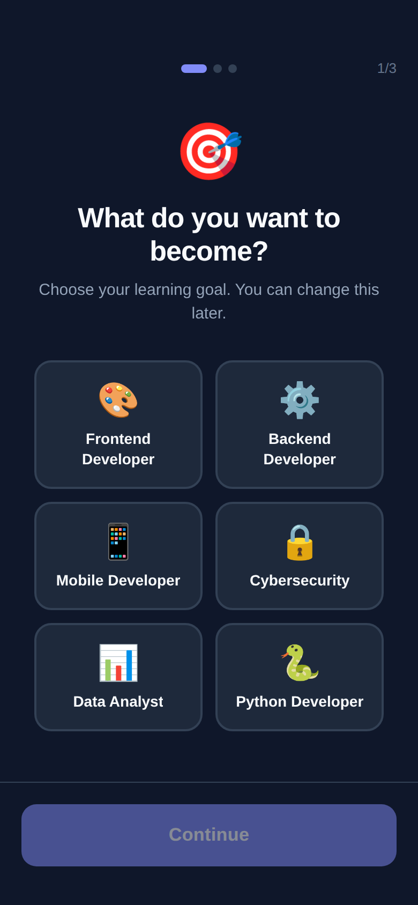
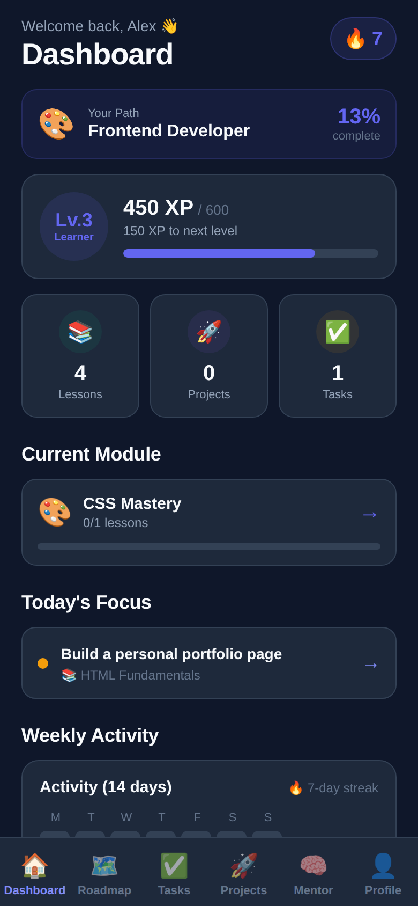
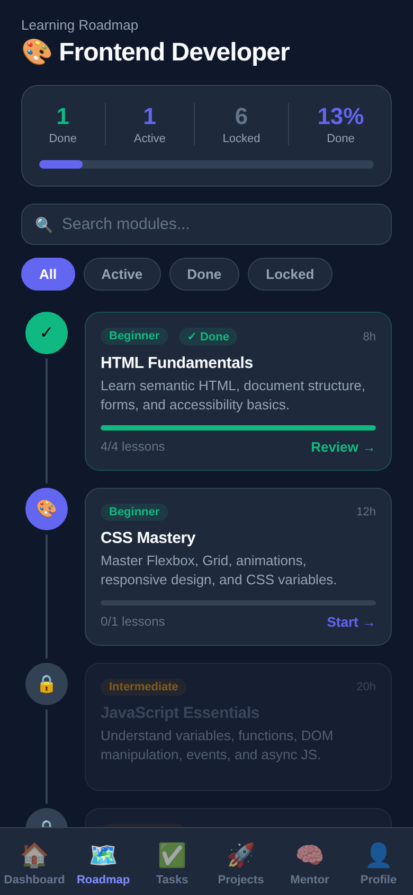
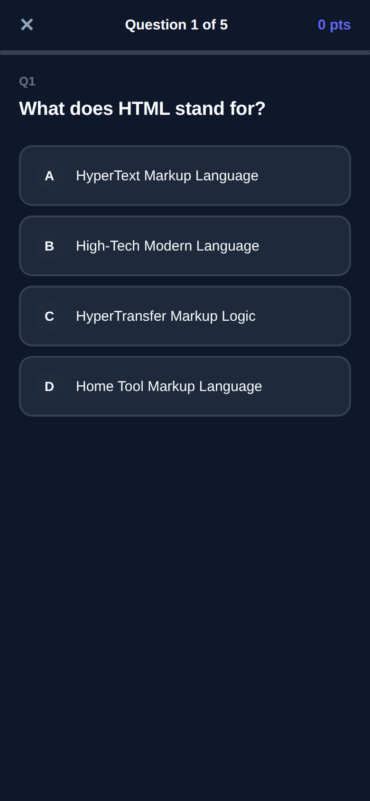
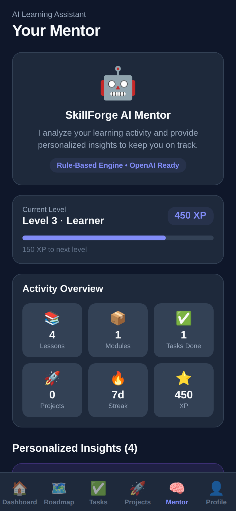

# ⚡ SkillForge AI — Mobile Learning Roadmap Assistant

> Mobile app that helps aspiring developers follow structured learning
> roadmaps, complete tasks, build portfolio projects and track progress,
> with a built-in mentor engine.

> **Czym jest „AI" w nazwie.** Silnik mentora jest **oparty na regułach**,
> nie na modelu językowym. Analizuje aktywność użytkownika (dni bez lekcji,
> długość serii, stosunek lekcji do projektów, liczba zaległych zadań, progi
> XP) i wybiera podpowiedź z drabinki warunków. Nie ma tu żadnego wywołania
> API modelu i nie ma na to klucza w konfiguracji.
>
> Warstwa serwisów jest napisana tak, żeby dało się ją podmienić na
> wywołanie modelu bez zmiany reszty aplikacji — sygnatura funkcji i typ
> zwracany zostają te same. To jest jednak plan, a nie stan obecny, i nazwa
> projektu tego nie zmienia.

---

## 📱 App Preview

SkillForge AI guides you from zero to job-ready developer through:
- **Structured roadmaps** for 6 developer career paths
- **Lesson-by-lesson learning** with progress tracking
- **Module quizzes** with XP rewards
- **Task management** to stay organized
- **Portfolio project suggestions** to impress recruiters
- **Podpowiedzi mentora** wyliczane z reguł na podstawie aktywności (nie z modelu językowego)

| Onboarding | Dashboard | Roadmap |
|:---:|:---:|:---:|
|  |  |  |
| **Quiz** | **Mentor** | |
|  |  | |

> Zrzuty z **wersji webowej** (Expo web / react-native-web) w widoku telefonu
> 390×844, w trybie demo. To ten sam kod co w aplikacji natywnej, tylko
> renderowany przez przeglądarkę, więc na iOS i Androidzie czcionki i cienie
> mogą wyglądać nieco inaczej. Szczegóły:
> [docs/screenshots/README.md](docs/screenshots/README.md).

---

## ✨ Features

| Feature | Description |
|--------|-------------|
| 🔐 **Authentication** | Register, login, persistent sessions via Supabase Auth |
| 🎯 **Onboarding** | Select goal, skill level, and daily time commitment |
| 🏠 **Dashboard** | Progress overview, streak, XP, current module, today's task |
| 🗺️ **Roadmap** | Module-based learning paths with progress tracking |
| 📖 **Lessons** | Detailed lesson content with completion tracking |
| 📝 **Quizzes** | Multiple-choice quizzes per module with scoring |
| ✅ **Tasks** | Full CRUD task manager with status and due dates |
| 🚀 **Projects** | Suggested + custom portfolio projects with GitHub links |
| 🧠 **Mentor** | Silnik regułowy; architektura przygotowana pod podmianę na model |
| 👤 **Profile** | Edit name, change goal/time, toggle dark/light theme |

---

## 🎓 Learning Paths

| Path | Description | Modules |
|------|-------------|---------|
| 🎨 **Frontend Developer** | HTML, CSS, JavaScript, React, TypeScript | 8 |
| ⚙️ **Backend Developer** | Node.js, REST APIs, Databases, Auth, Cloud | 8 |
| 📱 **Mobile Developer** | React Native, Expo, Navigation, Publishing | 7 |
| 🔒 **Cybersecurity** | Networking, Linux, Ethical Hacking, OWASP | 9 |
| 📊 **Data Analyst** | Python, SQL, Visualization, Machine Learning | 7 |
| 🐍 **Python Developer** | Python, OOP, APIs, Django/FastAPI, Automation | 8 |

---

## 🛠️ Tech Stack

| Layer | Technology |
|-------|-----------|
| **Framework** | Expo 51 + React Native 0.74 |
| **Language** | TypeScript 5.3 |
| **Navigation** | Expo Router 3 (file-based) |
| **Backend / DB** | Supabase (Auth + PostgreSQL) |
| **State Management** | Zustand 4 |
| **Forms** | React Hook Form + Zod validation |
| **UI** | Custom component library (dark/light) |
| **Storage** | AsyncStorage (session persistence) |

---

## 📂 Project Structure

```
skillforge-ai-mobile/
├── app/                          # Expo Router screens
│   ├── _layout.tsx               # Root layout (auth, theme init)
│   ├── index.tsx                 # Route guard
│   ├── auth/
│   │   ├── login.tsx             # Login screen
│   │   └── register.tsx          # Register screen
│   ├── onboarding/
│   │   └── index.tsx             # 3-step onboarding flow
│   ├── (tabs)/
│   │   ├── _layout.tsx           # Tab bar
│   │   ├── dashboard.tsx         # Dashboard
│   │   ├── roadmap.tsx           # Learning roadmap
│   │   ├── tasks.tsx             # Task manager
│   │   ├── projects.tsx          # Portfolio projects
│   │   ├── mentor.tsx            # AI Mentor screen
│   │   └── profile.tsx           # User profile
│   ├── module/[id].tsx           # Module detail + lessons
│   ├── lesson/[id].tsx           # Lesson reader
│   └── quiz/[moduleId].tsx       # Module quiz
├── src/
│   ├── components/
│   │   ├── common/               # Button, Input, Card, Badge, etc.
│   │   ├── cards/                # ModuleCard, TaskCard, ProjectCard, etc.
│   │   └── forms/                # TaskForm, ProjectForm
│   ├── constants/                # Colors, labels, XP values
│   ├── lib/
│   │   ├── supabase.ts           # Supabase client (mock fallback)
│   │   └── mockData.ts           # Full mock dataset (demo mode)
│   ├── services/                 # Business logic layer
│   │   ├── authService.ts
│   │   ├── profileService.ts
│   │   ├── roadmapService.ts
│   │   ├── taskService.ts
│   │   ├── projectService.ts
│   │   ├── quizService.ts
│   │   ├── progressService.ts
│   │   └── mentorService.ts      # Rule-based AI engine
│   ├── stores/                   # Zustand global state
│   │   ├── authStore.ts
│   │   ├── taskStore.ts
│   │   ├── projectStore.ts
│   │   └── themeStore.ts
│   ├── types/                    # TypeScript interfaces
│   └── utils/                    # Formatting, color helpers
├── supabase/
│   ├── schema.sql                # Full database schema + RLS policies
│   └── seed.sql                  # Seed data for learning paths
├── .env.example                  # Environment variable template
├── app.json                      # Expo configuration
└── README.md
```

---

## 🚀 Getting Started

### Prerequisites

- Node.js 18+
- npm or yarn
- Expo CLI (`npm install -g expo-cli`)
- Expo Go app on your phone (for testing)

### 1. Clone and Install

```bash
git clone https://github.com/pawel123j/skillforge-ai-mobile.git
cd skillforge-ai-mobile
npm install
```

### 2. Environment Variables (Optional)

The app runs in **Demo Mode** if no Supabase credentials are provided.

```bash
cp .env.example .env
```

Edit `.env`:
```
EXPO_PUBLIC_SUPABASE_URL=https://your-project.supabase.co
EXPO_PUBLIC_SUPABASE_ANON_KEY=your-anon-key
```

### 3. Run the App

```bash
npx expo start
```

- Press `i` to open iOS simulator
- Press `a` to open Android emulator
- Scan QR code with Expo Go for physical device

---

## 🗄️ Supabase Setup

### 1. Create a Supabase Project

1. Go to [supabase.com](https://supabase.com) and create a new project
2. Note your **Project URL** and **Anon Key** from Settings → API

### 2. Run the Schema

```bash
# In Supabase SQL Editor, paste and run:
supabase/schema.sql
```

### 3. Run Seed Data

```bash
# In Supabase SQL Editor, paste and run:
supabase/seed.sql
```

### 4. Configure Environment

Add your Supabase URL and Anon Key to `.env`

### Database Schema

```sql
profiles         -- User profiles, goals, preferences
learning_paths   -- 6 career paths
modules          -- Learning modules per path
lessons          -- Lessons per module
tasks            -- User tasks (CRUD)
projects         -- Portfolio projects
quiz_questions   -- Multiple choice questions per module
quiz_results     -- User quiz scores
user_progress    -- XP, streak, completed lessons/modules
```

### Security (RLS)

- ✅ Users can only read/write their own `profiles`, `tasks`, `projects`, `quiz_results`, `user_progress`
- ✅ `learning_paths`, `modules`, `lessons`, `quiz_questions` are readable by all authenticated users
- ✅ Service role key is never exposed in the frontend
- ✅ Automatic profile + progress creation on signup via database trigger

---

## 🌐 Environment Variables

| Variable | Description | Required |
|----------|-------------|----------|
| `EXPO_PUBLIC_SUPABASE_URL` | Your Supabase project URL | No (uses mock mode) |
| `EXPO_PUBLIC_SUPABASE_ANON_KEY` | Your Supabase anon/public key | No (uses mock mode) |

> ⚠️ **Never commit `.env` files.** The `.gitignore` already excludes them.

---

## 🎨 Demo Mode

If Supabase credentials are not configured, the app automatically runs in **Demo Mode**:
- Uses a full mock dataset with realistic data
- All features work — roadmap, tasks, projects, mentor, quiz
- No network calls are made
- Perfect for running and evaluating locally

Przełącznik jest jeden i jest jawny: `IS_MOCK_MODE` w `src/lib/supabase.ts`.
Ustawia się sam na `true`, gdy w konfiguracji nie ma adresu i klucza
Supabase — nie ma osobnej flagi do zapomnienia. Serwisy sprawdzają go
u siebie i zwracają dane z `src/lib/mockData.ts`.

**Do oceny projektu nie trzeba niczego konfigurować.** `npm install`
i `npx expo start` wystarczą; Supabase jest potrzebny dopiero, gdy chcesz
trwałych danych i logowania między urządzeniami.

Zrzuty ekranu: patrz [docs/screenshots/README.md](docs/screenshots/README.md).

---

## ✅ Testy, lint i CI

```bash
npm run lint         # ESLint
npm run type-check   # tsc --noEmit
npm test             # 15 testów silnika mentora
```

CI uruchamia wszystkie trzy na każdej gałęzi.

**ESLint nie działał do tej pory w ogóle.** Skrypt `lint` był w package.json
od początku, ale nie było pliku konfiguracyjnego — polecenie kończyło się
komunikatem „ESLint couldn't find a configuration file". Teraz konfiguracja
jest, a próg `--max-warnings 23` to **rejestr długu, nie cel**: ma spadać,
nigdy rosnąć. Zostało 14 ostrzeżeń `react-hooks/exhaustive-deps` i kilka
nieużywanych zmiennych w ekranach. Tablic zależności świadomie nie ruszałem —
ich zmiana zmienia, kiedy efekt się uruchamia, a bez możliwości odpalenia
aplikacji nie da się sprawdzić skutku.

Testy pokrywają silnik mentora, bo to jedyna nietrywialna logika biznesowa
w projekcie. Sprawdzają przede wszystkim **kolejność reguł**: pierwszy
pasujący warunek wygrywa i przesłania resztę, więc to, że ostrzeżenie
o bezczynności ma pierwszeństwo przed gratulacjami za serię, jest decyzją
produktową — a w kodzie widać ją wyłącznie przez układ `if`-ów.

---

## ⚠️ Znane podatności zależności

`npm audit` zgłasza **1 krytyczną i 13 wysokich**, których **nie da się
naprawić bez migracji Expo SDK 51 → 57 i React Native 0.74 → 0.87**.
Wszystko, co dało się naprawić bez zmiany wersji głównych, zostało
naprawione (58 → 44 zgłoszeń); wersje w obrębie SDK 51 podniesione do
najnowszych łatek.

Dwie rzeczy warte odnotowania:

1. **To są narzędzia deweloperskie, nie kod aplikacji.** Sprawdzone
   w drzewie zależności: `react-native` jest oznaczone wyłącznie *przez*
   `@react-native-community/cli*`, a pozostałe wpisy to `metro`,
   `@expo/cli`, `tar`, `postcss`, `image-size` i serwer deweloperski.
   Żadne z nich nie trafia do binarki instalowanej na telefonie. Ryzyko
   dotyczy maszyny, na której budujesz, a nie użytkownika aplikacji.
2. **Migracja SDK to osobne zadanie.** Sześć wersji głównych SDK
   (expo-router 3 → 6, React 18 → 19, nowa architektura React Native)
   to zmiana, której nie da się zweryfikować bez uruchomienia aplikacji
   na emulatorze. Zrobiona „na ślepo" byłaby gorsza niż jej brak.

CI raportuje ten stan do logu, ale **nie blokuje** na nim builda —
blokujące `npm audit` oznaczałoby CI stale czerwone niezależnie od zmian
w kodzie, a takie CI przestaje się czytać.

---

## 🧠 Silnik mentora

The mentor screen uses a **rule-based engine** that analyzes:
- Days since last activity → inactivity warnings
- Streak days → streak milestone celebrations
- Completed lessons vs. projects → actionable suggestions
- Pending task count → focus reminders
- XP milestones → achievement messages

The service layer is designed to be **drop-in replaced** with OpenAI API:

```typescript
// src/services/mentorService.ts
// Replace generateMentorInsight() with an OpenAI chat completion call
// The function signature and return types stay the same
```

---

## 📊 XP System

| Action | XP Reward |
|--------|-----------|
| Complete a lesson | +50 XP |
| Complete a task | +25 XP |
| Complete a project | +200 XP |
| Pass a quiz | +100 XP |
| Streak day bonus | +10 XP |

Levels: Newcomer → Apprentice → Learner → Developer → Practitioner → Engineer → Senior Dev → Expert

---

## 🚢 Deployment / GitHub Setup

### Automatic (GitHub CLI)

```bash
git init
git add .
git commit -m "Initial commit: SkillForge AI mobile app"
gh repo create skillforge-ai-mobile --public --source=. --remote=origin --push
```

### Manual

1. Create a new public repository at [github.com/new](https://github.com/new) named `skillforge-ai-mobile`
2. Copy the repository URL
3. Run:

```bash
git init
git add .
git commit -m "Initial commit: SkillForge AI mobile app"
git branch -M main
git remote add origin https://github.com/YOUR_USERNAME/skillforge-ai-mobile.git
git push -u origin main
```

---

## 📱 Building for Production

### Install EAS CLI

```bash
npm install -g eas-cli
eas login
eas build:configure
```

### Build for iOS / Android

```bash
eas build --platform ios
eas build --platform android
```

### Submit to App Store / Play Store

```bash
eas submit --platform ios
eas submit --platform android
```

---

## 🔮 Future Improvements

- [ ] **OpenAI GPT-4 Mentor** — Replace rule engine with conversational AI
- [ ] **Push Notifications** — Daily learning reminders and streak alerts
- [ ] **Social Features** — Follow other learners, compare streaks
- [ ] **Video Lessons** — Embedded video player with timestamps
- [ ] **Code Sandbox** — In-app code editor with live preview
- [ ] **Certificates** — Shareable completion certificates per path
- [ ] **Community** — Q&A forum and study groups
- [ ] **Analytics Dashboard** — Weekly/monthly learning reports
- [ ] **Offline Mode** — Cache lessons for offline reading
- [ ] **Apple/Google Login** — OAuth social login

---

## 🏆 Portfolio Description

**SkillForge AI** is a production-quality mobile application demonstrating:

- **Full-stack mobile architecture** — Expo + React Native + TypeScript + Supabase
- **Authentication flows** — Registration, login, session persistence, route guards
- **Complex state management** — Multiple Zustand stores with async actions
- **Form validation** — React Hook Form + Zod schemas
- **Clean service layer** — Separation of concerns between UI and business logic
- **Database design** — Relational schema with RLS security policies
- **Mock/real data strategy** — Graceful fallback when backend is unavailable
- **Rule-based AI system** — Extensible mentor engine with OpenAI-ready architecture
- **Dark/light theming** — System-level theme with persistent user preference
- **Mobile UX patterns** — Pull-to-refresh, modals, tab navigation, loading states

This project is ready to present in technical interviews and demonstrates real-world patterns used in production mobile applications.

---

## 📄 License

MIT — patrz [LICENSE](LICENSE).

---

Built with ⚡ by [SkillForge AI](https://github.com/pawel123j/skillforge-ai-mobile)
